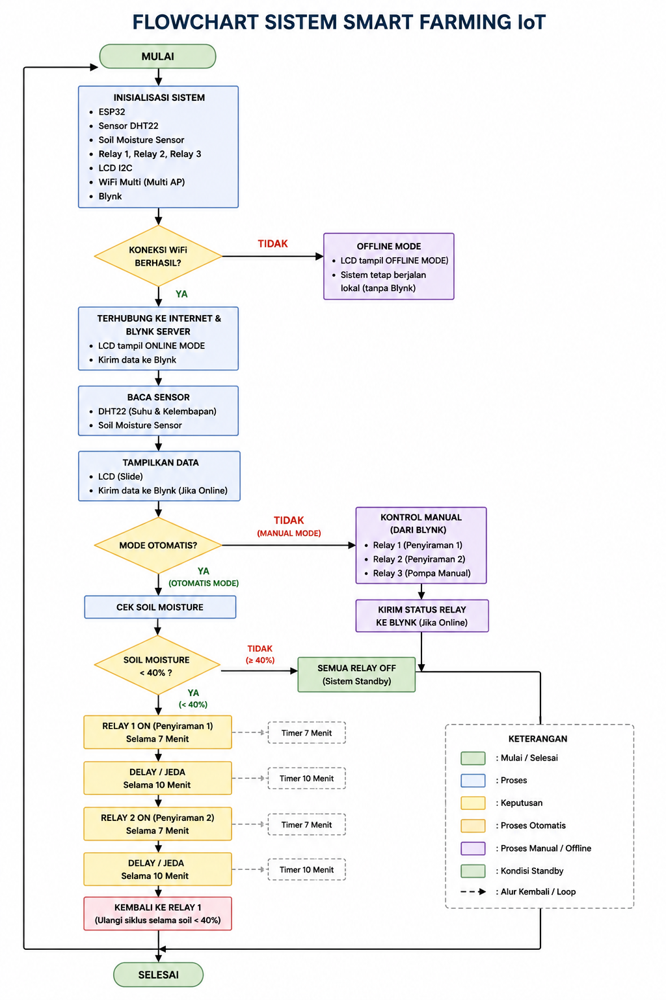
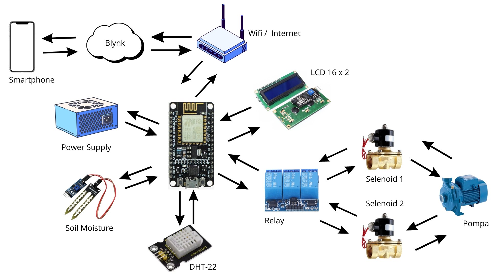
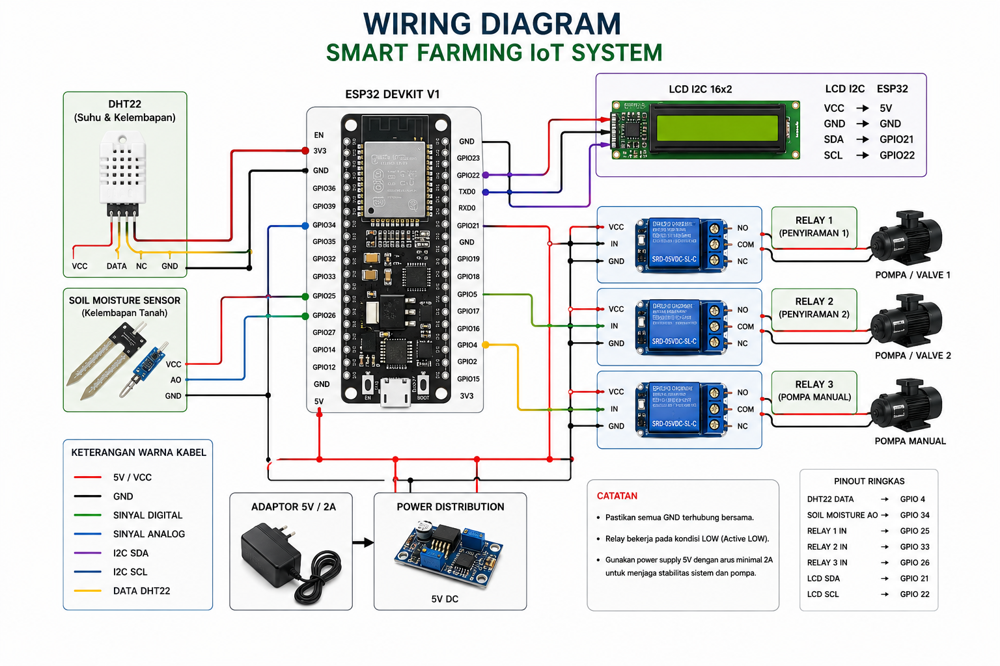
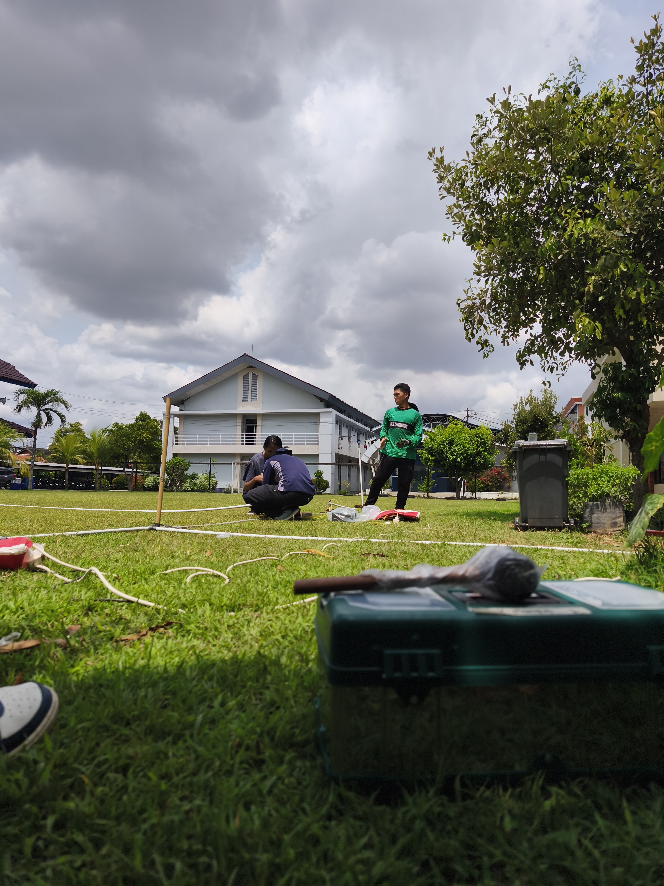

# 🌱 Smart Farming IoT System

IoT-based smart farming system developed to monitor environmental conditions and automate irrigation using ESP32, Soil Moisture Sensor, DHT22, LCD I2C, and Blynk IoT Platform.

---

# 📖 Overview

This project was developed to support smart irrigation by monitoring soil moisture, temperature, and humidity in real time. The system automatically controls irrigation based on soil moisture levels and provides both automatic and manual control through the Blynk IoT platform.

The project also supports Offline Mode, allowing the irrigation system to continue operating even when the internet connection is unavailable.

---

# ✨ Features

* Real-time soil moisture monitoring
* Temperature and humidity monitoring
* Automatic irrigation system
* Manual pump control via Blynk
* LCD 16x2 monitoring display
* WiFi Multi AP connection
* Online and Offline operating modes
* Automatic relay scheduling with timer and delay
* Real-time monitoring through Blynk Dashboard

---

# 🛠 Hardware Components

* ESP32 DevKit V1
* DHT22 Temperature & Humidity Sensor
* Soil Moisture Sensor
* LCD I2C 16x2
* Relay Module (3 Channel)
* Water Pump / Solenoid Valve
* Power Supply

---

# 💻 Software & Tools

* Arduino IDE
* ESP32 Board Package
* Blynk IoT Platform
* WiFi Multi
* LiquidCrystal I2C Library
* DHT Library
* C++

---

# ⚙️ System Workflow

1. ESP32 initializes all sensors and modules.
2. Connects to the available WiFi network using WiFi Multi.
3. Reads temperature, humidity, and soil moisture data.
4. Displays sensor values on the LCD.
5. Sends monitoring data to the Blynk dashboard.
6. Checks the operating mode (Automatic or Manual).
7. In Automatic Mode:

   * Relay 1 activates for irrigation.
   * Waits for the configured delay.
   * Relay 2 activates.
   * Repeats the irrigation cycle while soil moisture is below the threshold.
8. In Manual Mode:

   * Relay control is performed directly from the Blynk application.
9. The monitoring process repeats continuously.

---

# 📂 Project Structure

```text
Smart-Farming-IoT/
│
├── Arduino/
│   └── smart_farming.ino
│
├── Diagram/
│   ├── flowchart_sistem.png
│   ├── block_diagram.png
│   └── wiring_diagram.png
│
├── Screenshot/
│   ├── prototype_vertikal.jpg
│   ├── instalasi_di_taman.jpg
│   ├── sistem_penyiraman.jpg
│   ├── implementasi_smart_farming.jpg
│   └── pengujian_lapangan.jpg
│
└── README.md
```

---

# 🔄 System Flowchart



---

# 🧩 Block Diagram



---

# 🔌 Wiring Diagram



---

# 📸 Project Documentation

## Vertical Prototype


---

## Installation at Garden



---

## Irrigation System


---

## Smart Farming Implementation


---

## Field Testing


---

# 📊 Monitoring Parameters

| Parameter     | Description                 |
| ------------- | --------------------------- |
| Temperature   | Air temperature monitoring  |
| Humidity      | Air humidity monitoring     |
| Soil Moisture | Soil moisture monitoring    |
| Relay 1       | Automatic Irrigation Zone 1 |
| Relay 2       | Automatic Irrigation Zone 2 |
| Relay 3       | Manual Pump Control         |

---

# 🎯 Objectives

* Monitor environmental conditions in real time.
* Automate irrigation based on soil moisture.
* Improve irrigation efficiency.
* Reduce manual watering.
* Support smart agriculture using IoT technology.

---

# 👨‍💻 Author

**Aldo Raditya Pangestu**

Computer Systems Graduate | IoT Developer | Embedded Systems Enthusiast

**Technologies**

* ESP32
* Arduino IDE
* Blynk IoT
* C++
* Embedded Systems
* Smart Farming
* IoT Automation

---

⭐ If you find this project useful, feel free to give it a star.
